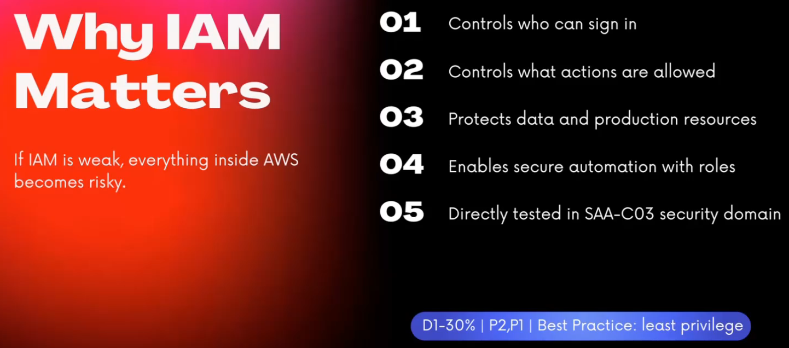
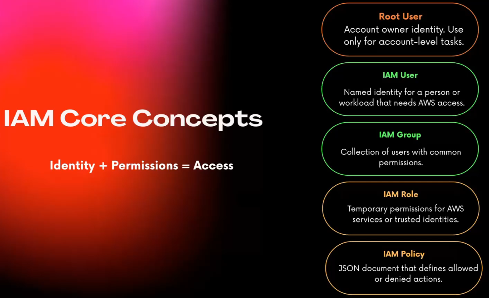
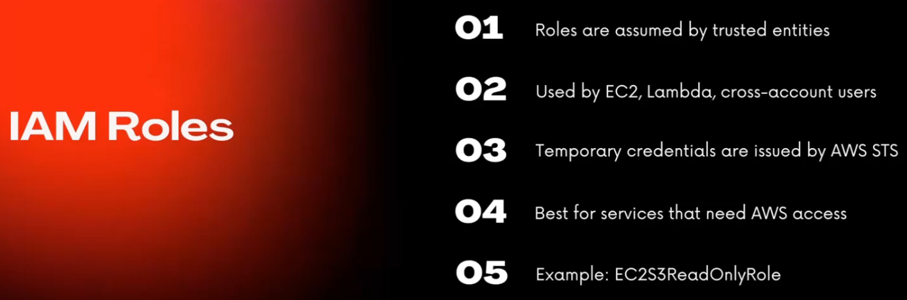
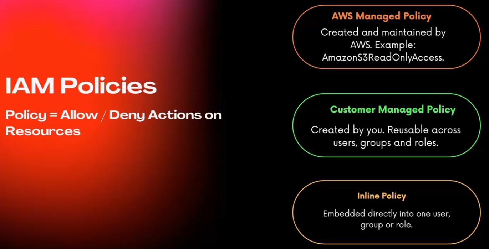
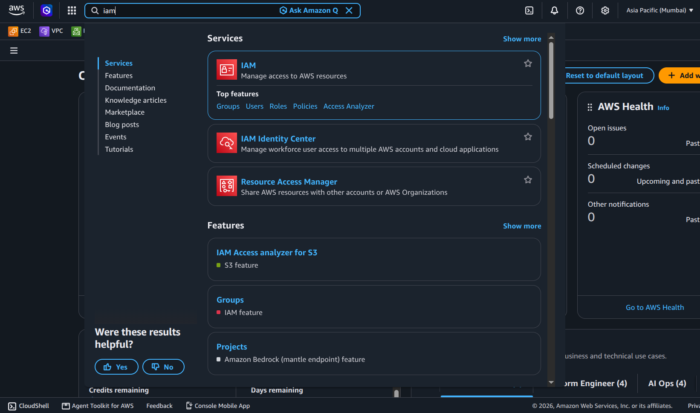
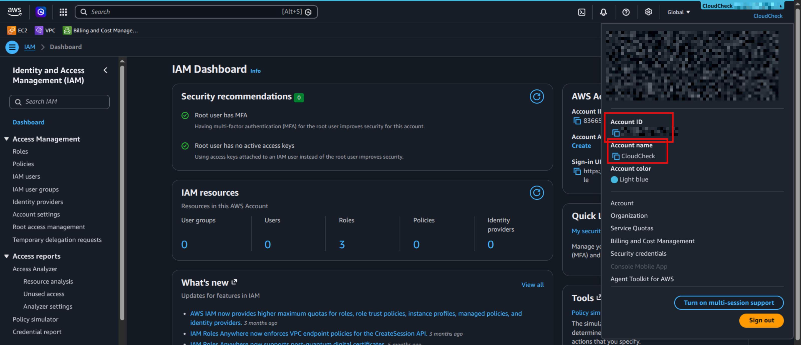

# IAM

IAM in AWS console

Here root user credentials are shown, no IAM user credentials are shown as we logged in as root user. 

In case of specific IAM user the respective creditials would be appear here.

